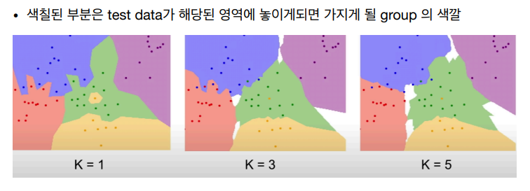
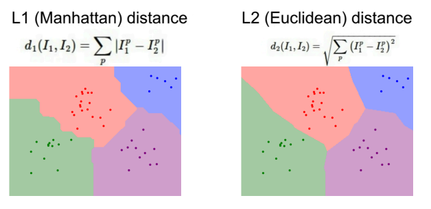
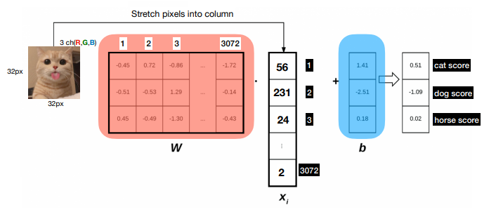
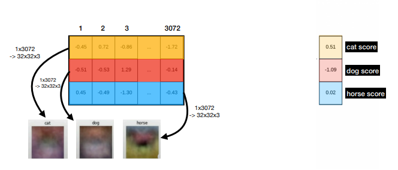

### Image Classification
* Computer Vision : intelligence를 만들기 위해 visual perception을 먼저 만드는 것
* Computer Vision <-> Computer Graphic

#### KNN(K-Nearest Neighbor)
* simple image classifier
* 훈련 단계에서는 아무것도 하지 않
고 모든 훈련 데이터를 기억
*  예측 단계에서는 새로운 이미지를
가져와 앞서 훈련단계에서 보았던
데이터 중 가장 유사한 이미지를 찾
아 그 이미지의 라벨로 예측
* K는 주변의 몇개의 데이터를 통해 distance를 참조할지를 결정
* 
* Distance Metric
  
  * L1 distance (Manhattan distance) 혹은 L2 distance (Euclidean distance)를 일반적으로 사용
* 그러나 KNN은 이미지에 사용되지 않는다. 시간이 너무 오래걸리고, 이미지간의 지각적 유사성 거리와 픽셀간의 거리가 일치하지 않기 때문이다. 즉 누가봐도 다른 사진을 같은 사진으로 인식할 수도 있다.
  
#### Linear Classification (선형 분류)
* 선형 모델로 score vector를 뽑을 수 있고 이 벡터를 통해 loss를 구하고 이를 업데이트하여 간단한 분류를 할 수 있다.

* 그러나 이런 구조는 각 클래스에 대한 정보가 가중치 벡터의 행벡터 형태로 나타난다. 즉 가중치 벡터의 각 행이 하나의 클래스 정보를 담는다. 이는 하나의 클래스의 다양한 특징을 담기 어렵다는 한계점을 가지고 있다. 

#### Regularization (정규화)
* L2 Regularization
$$\text{Cost} = \dfrac{1}{n} \sum_{i=1}^{n} \{ L(y_i, \hat{y}_i) + \dfrac{\lambda}{2} |w|^2 \} $$
    * 매끄러운 그래프를 원할때 주로 사용
    * 특정 요소만의 의존 보다는 모든 요소의 전체적인 영향을 받는다.
* L1 Regularization
$$\text{Cost} = \dfrac{1}{n} \sum_{i=1}^{n} \{ L(y_i, \hat{y}_i) + \dfrac{\lambda}{2} |w| \} $$
    * 분류기가 복잡할 때 주로 쓰는 정규화 방식
    * 가중치값에 0이 많게 해 보다 더 단순한 식을 만들어준다.
  