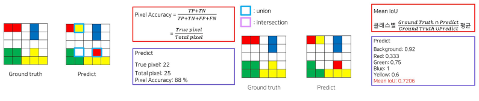

### Semantic Segmentation

* Semantic Segmentation은 이미지 내의 각 픽셀을 레이블 된 클래스로 분류하는 작업이다.
* 이미지 내의 각 픽셀이 어떤 객체에 속하는지에 대한 정보를 제공
* 각 픽셀은 레이블된 클래스(예: 사람, 자동차, 나무 등) 중 하나에 속하며, 이미지에서 객체의 윤곽을 정확하게 식별할 필요는 없다.
  
### Instance Segmentation

* Instance Segmentation은 Semantic Segmentation과 객체 간에 구분을 하면서 더욱 정확한 객체의 경계를 식별하는 작업
* 이미지 내의 각 픽셀을 클래스 레이블뿐만 아니라, 각 객체의 윤곽으로 연결하여 분할
* 이미지에서 다른 객체들을 정확하게 식별하고, 각 객체의 경계를 정확히 추출할 수 있다.

### FCN(Fully Convolutional Network)
* VGG Backbone 으로 사용하고 FC Layer를 1*1 convolution으로 변경하고, Transposed Conv를 통해 Pixel Wise prediction을 수행하는 네트워크
* FCN의 성능 향상 기법
  * Skip Connection

### Segmentation 의 평가지표
* Pixel Accuary 
  * $\text{Pixel Accuracy} = \dfrac{\#TP + \#FN}{\#TP + \#TN + \#FP + \#FN}$
* Mean IOU
  * class 별 $\dfrac{실제 \cap 예측 중복 영역}{실제 \cup 예측 전체 영역}$ 평균
* Frequency Weighted IOU
  * class 별 분포 고려
  

$\to$ FCN의 한계점
* 객체의 크기가 작을 때 예측을 잘못함.
* 객체의 디테일한 모습이 사라진다.
  * $\to$ FCN의 문제점을 인코더와 디코더 구조를 사용해 해결하려는 아키텍처가 DeconvNet
  